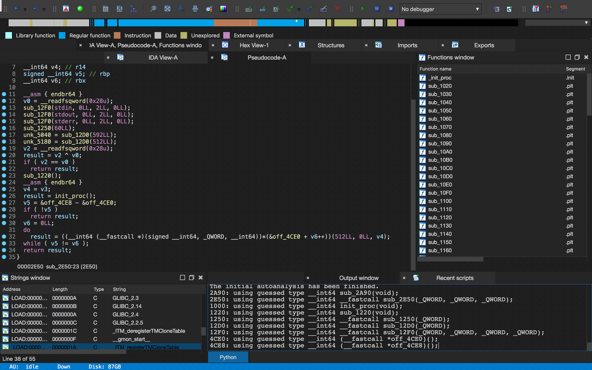
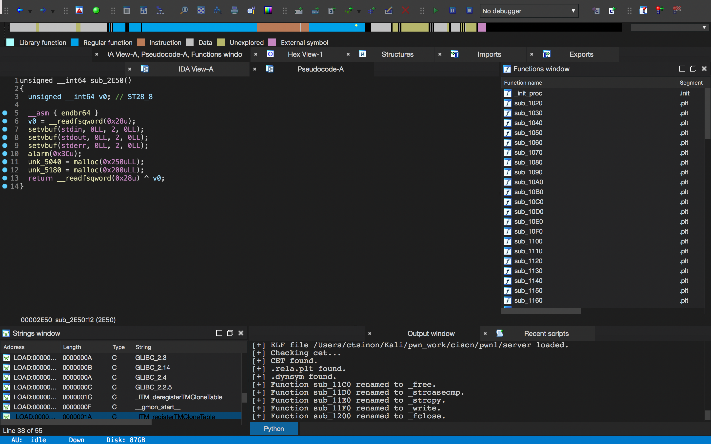

# ida_fxxk_cet
解决IDA Pro 7.0版本在遇到使用CET技术的ELF文件时符号解析错误的问题

症状：打开ELF文件时IDA报错：`Unexpected plt stub`，且符号解析不正确，函数开头存在endbr指令。

依赖：elftools库

如下图所示（题目为2020 ciscn final Day1 server）：

使用方法：在file->Script File...中运行该脚本。

效果如下：

